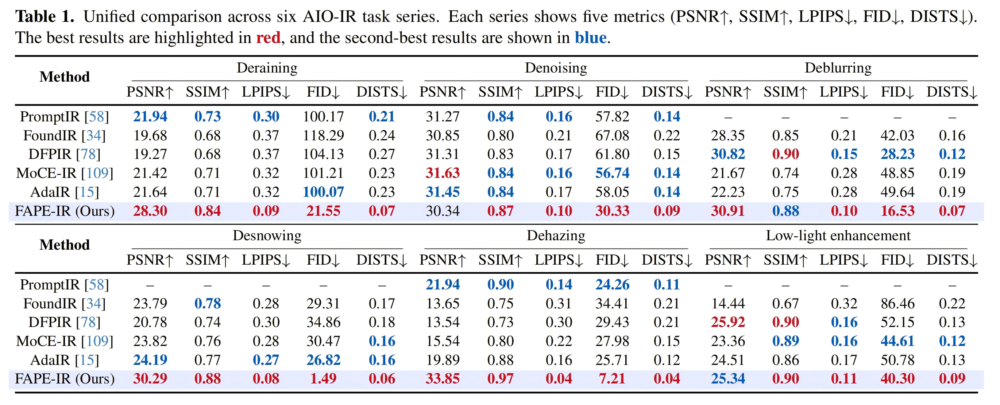
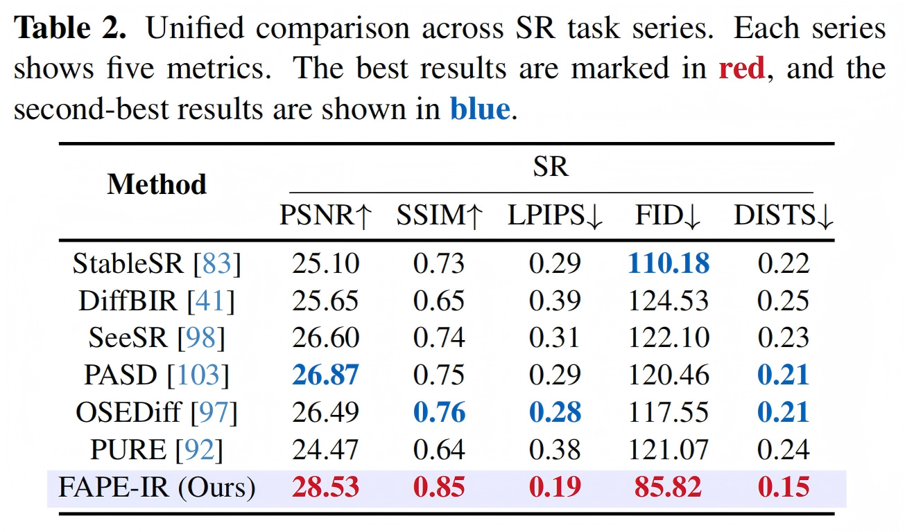
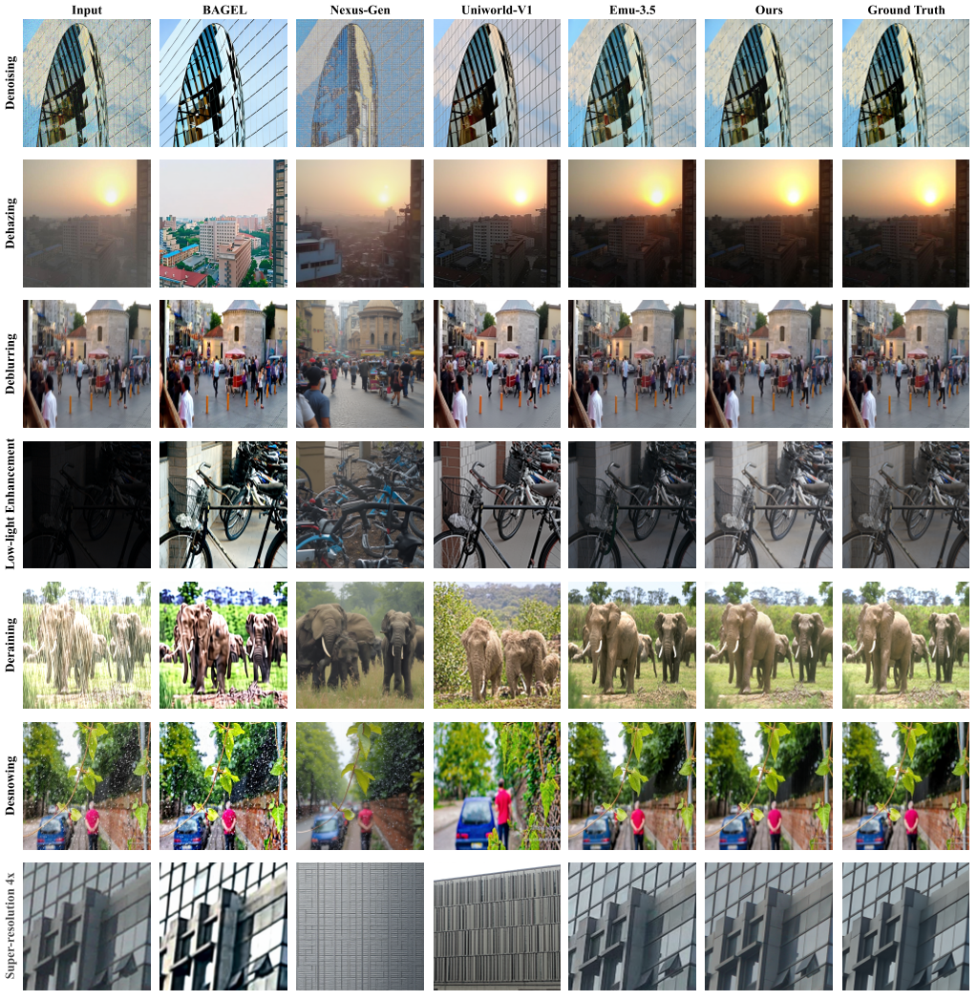
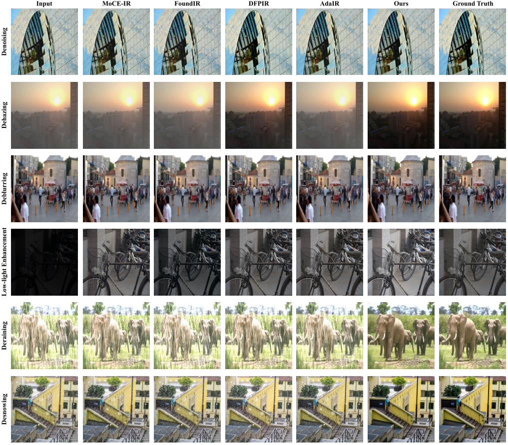

<p align="center">
  
</p>

### FAPE-IR: Frequency-Aware Planning and Execution Framework for All-in-One Image Restoration

[](https://github.com/Programmergg/FAPE-IR)

> [[Paper (arXiv)](https://arxiv.org/abs/2511.14099)] &emsp;
> **Jingren Liu**<sup>&#42;</sup>, **Shuning Xu**<sup>&#42;</sup>, **Qirui Yang**<sup>&#42;</sup>, **Yun Wang**, **Xiangyu Chen**<sup>✉</sup>, **Zhong Ji**<sup>✉</sup> <br>
> <small><sup>&#42;</sup>Equal contribution &emsp; <sup>✉</sup>Corresponding author</small>

---

*This repo is an early exploration of unified image restoration (unified understanding & generation). We are actively investigating more lightweight designs and alternatives beyond the MLLM + Diffusion paradigm, and will continuously maintain and update this repo with new progress.*

*The three authors are struggling with their doctoral dissertations. Please wait a moment while they work on cleaning the code and providing new directions and suggestions.*

---

## 🚩 New Features/Updates
- ✅ Nov 25, 2025. Release the arXiv paper.
- ✅ Apr 10, 2026. Release training and testing code.
- ✅ Apr 12, 2026. Initial weights are now available on Hugging Face.
- 🚧 TBD. Release pretrained checkpoints & model zoo.
- 🚧 TBD. Release standalone inference / evaluation scripts and example results.

Please **star** this repo to get updates.

---

## :book: Resources

### Checkpoints / Datasets / Results

| Item | Link |
|:-|:-|
| Initial weights | [Hugging Face - FAPEIR_Uniworld](https://huggingface.co/David0219/FAPEIR_Uniworld) |
| Pretrained checkpoints / model zoo | TBD |
| Testset (GT/LQ) | TBD |
| Visual results | TBD |
| Compared methods | TBD |

---

## :computer: Usage

### :arrow_right: Environment

```bash
conda create -n fapeir python=3.11 -y
conda activate fapeir

# Please install dependencies according to your local CUDA / PyTorch setup.
# A reproducible requirements file will be released soon.
```

### :arrow_right: Prepare Initial Weights

Before training, please first create a `weights` directory in the project root and place all released initial weights into it.

```bash
mkdir -p weights
```

A recommended layout is:

```text
FAPE-IR/
├── weights/
│   ├── flux/
│   ├── siglip/
│   ├── uniworld/
│   ├── denoise_projector_params.bin
│   ├── flux-redux-siglipv2-512.bin
│   ├── vae_projector_only.bin
│   └── vgg.pth
├── scripts/
├── fapeir/
├── train.py
└── validation.py
```

You can download the initial weights from:

```text
https://huggingface.co/David0219/FAPEIR_Uniworld
```

### :arrow_right: Modify Weight Paths in `scripts/`

After placing the initial weights into `weights/`, please modify the relevant paths in:

```text
scripts/denoiser/flux_qwen2p5vl_7b_vlm_512.yaml
```

Please update the path-related fields as follows:

```yaml
training_config:
  output_dir: trained_weights/fapeir
  logging_dir: trained_weights/fapeir
  lpips_weights_path: weights/vgg.pth

model_config:
  pretrained_lvlm_name_or_path: weights/uniworld
  pretrained_denoiser_name_or_path: weights/flux
  pretrained_mlp2_path: weights/denoise_projector_params.bin
  pretrained_mlp3_path: weights/vae_projector_only.bin
  pretrained_siglip_name_or_path: weights/siglip
  pretrained_siglip_mlp_path: weights/flux-redux-siglipv2-512.bin
```

If your local file layout is different, please modify the YAML paths accordingly. The important point is that all fields in the config must match your actual local file locations.

If you use the shell launchers under `scripts/denoiser/`, please also modify your local machine-dependent variables there, such as:

- `PY`
- `ENV_BIN`
- `LOG_DIR`
- `SESSION_NAME`
- `MASTER_ADDR`
- `MASTER_PORT`
- `MACHINE_RANK`
- `NUM_MACHINES`

### :arrow_right: Training

After the initial weights are prepared and the YAML paths are updated, you can start training.

**Single-node training**

```bash
python -m accelerate.commands.launch \
  --config_file scripts/accelerate_configs/single_node_zero2.yaml \
  train.py \
  scripts/denoiser/flux_qwen2p5vl_7b_vlm_512.yaml
```

**Multi-node training**

```bash
python -m accelerate.commands.launch \
  --config_file scripts/accelerate_configs/multi_node_zero2.yaml \
  --num_machines <NUM_MACHINES> \
  --machine_rank <MACHINE_RANK> \
  --main_process_ip <MASTER_ADDR> \
  --main_process_port <MASTER_PORT> \
  train.py \
  scripts/denoiser/flux_qwen2p5vl_7b_vlm_512.yaml
```

**Using shell launchers**

If you want to launch training with the provided shell scripts, please first update your local paths and runtime variables in `scripts/denoiser/*.sh`, and then run your corresponding launcher.

### :arrow_right: Inference / Evaluation

Standalone inference and evaluation scripts are still being cleaned up and will be released in future updates.

---

## :floppy_disk: Data

### :arrow_right: Overview

The current public release uses:

- a **manifest file** (`datasets/train.txt`) to describe the training sources
- a **JSON annotation file** for each dataset subset
- a unified **testing root** under `datasets/sr_testing_data/`

A recommended directory layout is:

```text
FAPE-IR/
├── datasets/
│   ├── train.txt
│   ├── train_data/
│   │   ├── images/
│   │   └── annotations/
│   │       ├── train_task1.json
│   │       ├── train_task2.json
│   │       └── ...
│   └── sr_testing_data/
│       ├── DrealSR/
│       ├── RealSR/
│       ├── weather1/
│       ├── weather2/
│       ├── Snow100K-L/
│       ├── Snow100K-S/
│       ├── dehazing_test/
│       ├── LOL2/
│       ├── RealBlur_J/
│       ├── RealBlur_R/
│       ├── GoPro/
│       ├── Urban100_15/
│       ├── Urban100_25/
│       └── Urban100_50/
├── weights/
├── scripts/
└── ...
```

You may use a different local layout, but then you must modify the corresponding fields in `scripts/denoiser/flux_qwen2p5vl_7b_vlm_512.yaml`.

---

### :arrow_right: Training Manifest Format

The training manifest file is:

```text
datasets/train.txt
```

Each line describes one dataset source. The supported formats are:

```text
image_root,json_file,need_weight
```

or

```text
image_root,json_file,need_weight,need_degradation
```

Example:

```text
datasets/train_data/images,datasets/train_data/annotations/train_task1.json,true,true
datasets/train_data/images,datasets/train_data/annotations/train_task2.json,false,false
```

Field meanings:

- `image_root`: root directory of images referenced by the JSON file
- `json_file`: annotation file for this subset
- `need_weight`: whether to enable the corresponding weighting behavior
- `need_degradation`: whether to synthesize low-quality input from the target image on the fly

If `need_degradation` is omitted, the current loader treats it as `true`.

---

### :arrow_right: JSON Annotation Format

Each JSON file should be a list of samples.

#### Case 1: Degradation-based training

In this mode, the image is treated as the target image. The loader will randomly crop it to `512×512` and generate the low-quality input on the fly.

```json
[
  {
    "image": "gt/sample_0001.png"
  },
  {
    "image": "gt/sample_0002.png"
  }
]
```

In this case:

- the image is treated as the GT image
- the low-quality input is synthesized during training

#### Case 2: Paired training

In this mode, the first image is treated as the input image and the second image is treated as the GT image.

```json
[
  {
    "image": ["lq/sample_0001.png", "gt/sample_0001.png"]
  },
  {
    "image": ["lq/sample_0002.png", "gt/sample_0002.png"]
  }
]
```

In this case:

- the first image is treated as the input image
- the second image is treated as the GT image

---

### :arrow_right: Image Resolution Handling

For the current public training pipeline:

- degradation-based training uses random cropping and degradation synthesis
- paired training resizes both input and GT images to `512×512`
- the training config currently uses:
  - `height: 512`
  - `width: 512`

If you change these settings, please keep your data preparation and GPU memory budget consistent.

---

### :arrow_right: Validation / Test Data

The current config expects validation / test data under `datasets/sr_testing_data/`.

The default path-related fields in `scripts/denoiser/flux_qwen2p5vl_7b_vlm_512.yaml` are:

```yaml
dataset_config:
  data_txt: datasets/train.txt

  # DrealSR
  test_data_root: datasets/sr_testing_data/DrealSR
  test_scales: [2, 4]

  # Weather
  weather_test_data_root: datasets/sr_testing_data
  weather_test_types:
    - weather1
    - weather2
    - Snow100K-L
    - Snow100K-S

  # RealSR
  realsr_test_data_root: datasets/sr_testing_data/RealSR
  realsr_camera_types:
    - Canon
    - Nikon
  realsr_scale_factors:
    - 2
    - 4

  # Generic benchmarks
  generic_test_data_root: datasets/sr_testing_data
  generic_datasset_types:
    - dehazing_test
    - LOL2
    - RealBlur_J
    - RealBlur_R
    - GoPro
    - Urban100_15
    - Urban100_25
    - Urban100_50
```

> Note: please keep the key name `generic_datasset_types` unchanged in the current release, since it is intentionally kept for compatibility with the existing code.

In practice, each benchmark should be placed under the corresponding root path, and the YAML should be edited if your local folder names differ.

---

### :arrow_right: Recommended Workflow

A practical workflow is:

1. Prepare the initial weights under `weights/`
2. Modify the path fields in `scripts/denoiser/flux_qwen2p5vl_7b_vlm_512.yaml`
3. Prepare `datasets/train.txt`
4. Prepare the corresponding JSON annotation files
5. Organize validation / test data under `datasets/sr_testing_data/`
6. Start training with the provided Accelerate config

---

## :bar_chart: Results

### Quantitative Results

<p align="center">
  
  <br>
  <em>Figure 1. Quantitative comparison with state-of-the-art AIO-IR methods on six tasks (deraining, denoising, deblurring, desnowing, dehazing, low-light enhancement). <b>Best</b> in red, <u>second-best</u> in blue.</em>
</p>

<p align="center">
  
  <br>
  <em>Figure 2. Unified comparison across SR task series. Best in red, second-best in blue.</em>
</p>

### Qualitative Results

<p align="center">
  
  <br>
  <em>Figure 6. Qualitative comparison among unified models, including BAGEL, Nexus-Gen, Uniworld-V1, and Emu3.5.</em>
</p>

<p align="center">
  
  <br>
  <em>Figure 7. Qualitative comparison of restoration results produced by FAPE-IR and state-of-the-art AIO-IR models.</em>
</p>

---

## Citation

If you use this work, please cite:

```bibtex
@article{liu2025fape,
  title={FAPE-IR: Frequency-Aware Planning and Execution Framework for All-in-One Image Restoration},
  author={Liu, Jingren and Xu, Shuning and Yang, Qirui and Wang, Yun and Chen, Xiangyu and Ji, Zhong},
  journal={arXiv preprint arXiv:2511.14099},
  year={2025}
}
```

---

## Acknowledgement

We thank all collaborators and colleagues for their helpful discussions and support. We especially thank Dr. Xiangyu Chen and Professor Zhong Ji for their guidance and revisions to this work.

This project is built upon several foundational open-source works. We sincerely thank the authors of the following repositories for their invaluable contributions to the community:

* **Core Inspiration & Architecture:**
    * [UniWorld](https://github.com/PKU-YuanGroup/UniWorld): Greatly inspired our unified understanding and generation paradigm.
    * [Janus](https://github.com/deepseek-ai/Janus): Provided valuable insights into decoupled visual encoding.
* **Baselines & Comparisons:** We gratefully acknowledge the authors of BAGEL, Nexus-Gen, and Emu3.5 for open-sourcing their code and weights, which facilitated our qualitative and quantitative comparisons.
* **Frameworks & Utilities:** Our implementation relies on excellent open-source libraries, including Hugging Face's [diffusers](https://github.com/huggingface/diffusers) and [transformers](https://github.com/huggingface/transformers).

---

## Contact

If you have any questions, feel free to reach out:

* Email: jrl0219@tju.edu.cn; yc07425@um.edu.mo
